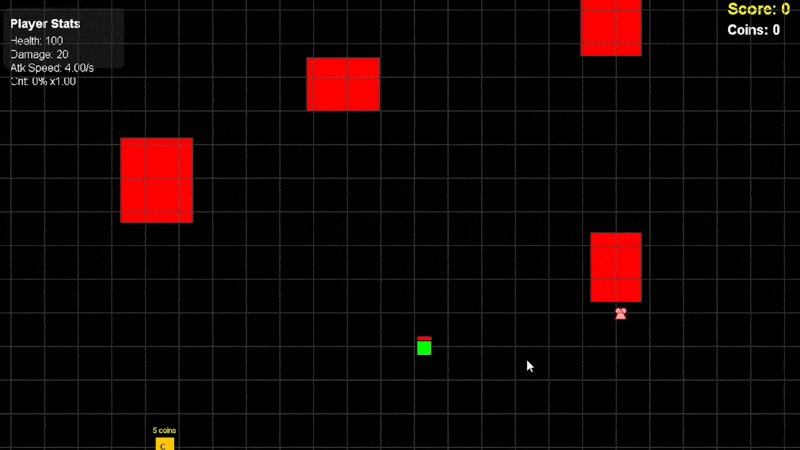
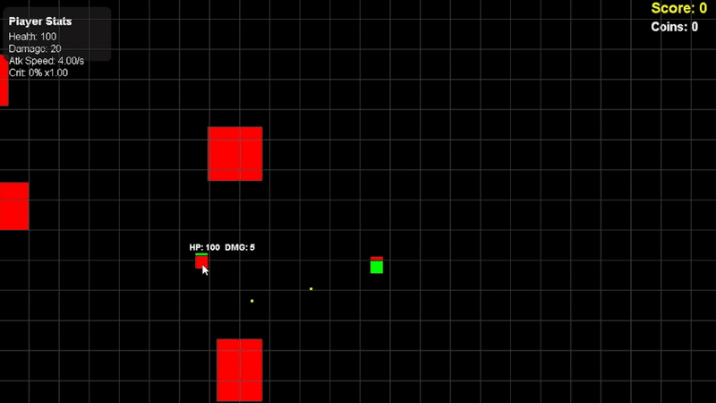
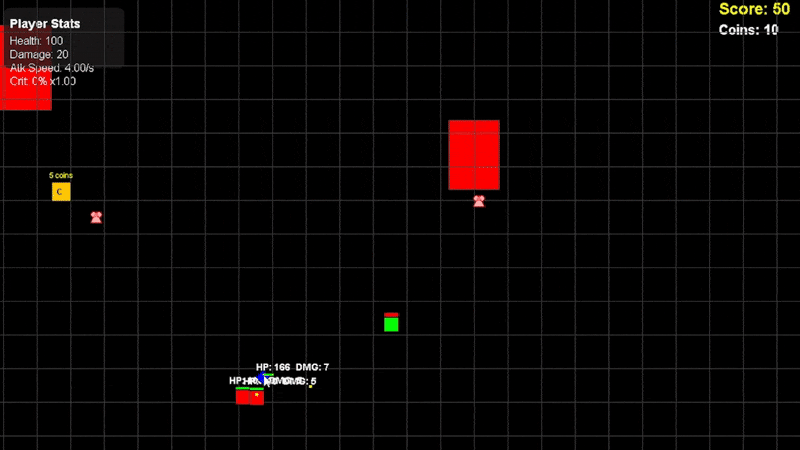
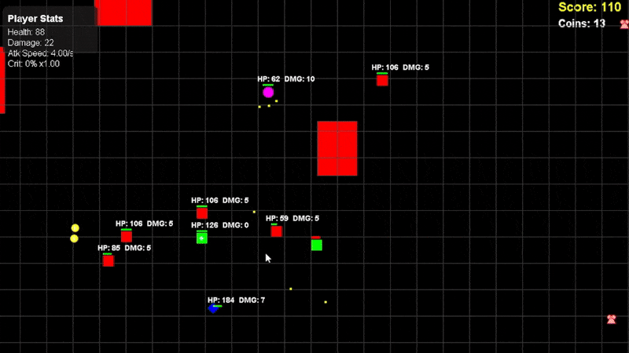
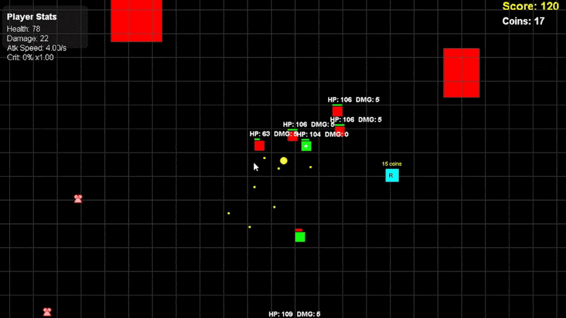
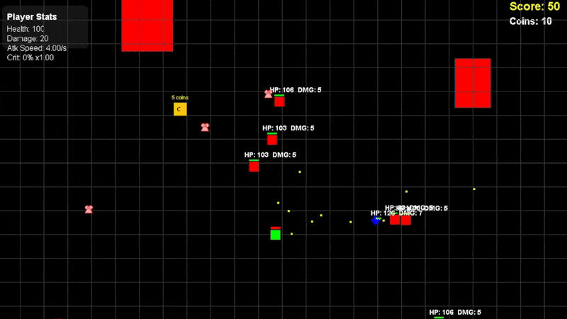

# Rogue Assault — Java Roguelike

A top-down roguelike shooter built in pure Java, created for students to learn from while I was teaching at University of Engineering and Technology, Peshawar.
The game demonstrates object-oriented design, AI state machines, and progressive difficulty — all implemented without any external game engine.

to download the game, either dowload whole repository and game is in dist folder or copy that dist folder link into a github folder downloader tool.

It simple downloads the rougelike/dist folder and then run the .exe

**🎮 Gameplay Overview**
You play as a square-shaped survivor who must fight waves of enemies, collect hearts to heal, and open random chests to upgrade your stats.

**👾 Enemies**
There are 4 enemy types, each with unique behaviors and AI logic:

🟥 Square (Basic Enemy)
Standard shooter that fires directly at the player.

💎 Diamond (Tank)
Heavy and durable enemy with slower movement.
Other enemies take cover behind it when nearby.
Provides protection to weaker allies.

⚪ Circle (Assault Type)
Fast-moving and aggressive.
Fires three spread bullets in a forward arc.

🟩 Healer
Doesn’t attack.
Heals low-HP allies within range periodically.

**🧠 AI & State Machine**
Each enemy runs on a state-driven AI system, including:
Idle/Patrol State: Moves randomly when no player is visible.
Chase State: Detects and moves toward the player once seen.
Attack State: Shoots when within attack range.
The system dynamically updates behavior based on player proximity and obstacles.

**💰 Loot & Progression**
Enemies drop coins upon death.
Hearts spawn randomly, allowing the player to heal.
Chests appear at random intervals and can be unlocked using coins.
Chests come in multiple rarities — each granting buffs such as:
Increased health
Higher damage
Faster attack rate
Higher critical chance 

**⚙️ Technical Highlights**
Pure Java Implementation — no external libraries or engines.
OOP Structure: Classes for Player, Enemy, Projectile, Chest, PowerUp, etc.
AI State Machines: Modular enemy behaviors.
Dynamic Difficulty: Enemy stats scale with game time.
Collision Detection: Custom system for walls, bullets, and entities.

**🧱 Features Summary**

✅ Player movement & shooting

✅ Walls block both player and enemy projectiles

✅ 4 enemy types with unique logic

✅ AI with chase, attack, and idle states

✅ Healing & stat upgrade system

✅ Progressive difficulty over time

**🛠️ Tech Stack**
Language: Java

Paradigm: Object-Oriented Programming
Graphics: Java AWT / Swing
Development Goal: Learn advanced OOP design and enemy AI without external engines

**🎯 What I Focused On**
Clean OOP architecture and class design.
Designing independent AI behaviors using state machines.
Implementing team synergy mechanics (e.g., healer and tank).
Balancing gameplay progression through dynamic scaling.

📄 License
MIT
